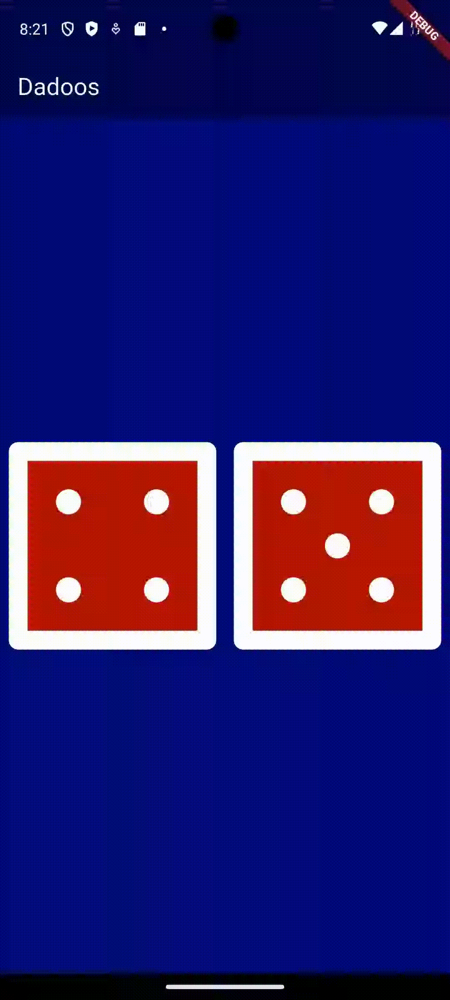

# Dadoos 🎲

Aplicativo de dados desenvolvido em Flutter durante meu aprendizado de desenvolvimento mobile.

Demo do App


## Sobre

Segundo projeto em Flutter onde implementei:

- State management com StatefulWidget
- Geração de números aleatórios
- Interatividade com GestureDetector
- Layouts responsivos com Row e Expanded

## Tecnologias

- Flutter
- Dart

## Como executar

```bash
flutter pub get
flutter run
```

## Autor

Projeto desenvolvido durante estudos de Flutter.
